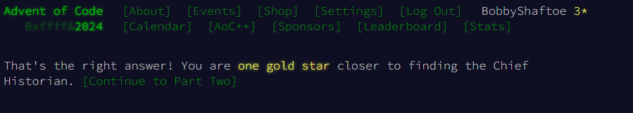

# Advent of Code 2024

## Lang
This Advent of Code attempt is written in Java 23.0.1


## Overview
Here's my attempt at the Advent of Code 2024. I'm using Java 23.0.1, IntelliJ IDEA 2024 & Copilot (only for language help and boilerplate)

Overall, the main approach is functional programming as much as possible; i.e. the Streams API and other language features.
My idea was also to leverage Java 21+ features at every opportunity, such as the new switch expressions and pattern matching.


## References
This is a bunch of references mostly about functional programming and using Streams API in Java 21+
### Java Streams
- https://medium.com/javarevisited/whats-new-with-java-23-698762aa44d1
- https://stackify.com/streams-guide-java-8/
- https://bell-sw.com/blog/a-guide-to-java-stream-api/
- https://www.happycoders.eu/java/stream-gatherers/

### Java solutions to AoC 2022
- https://www.happycoders.eu/algorithms/advent-of-code-2022/

### Miscellaneous references and notes
- Some window and groupby examples in Java, Python, R and Scala
  - https://spark.apache.org/docs/3.5.2/structured-streaming-programming-guide.html#basic-operations---selection-projection-aggregation
- Stuff from the vavr guy about the vavr package and functional programming in Java
  - https://www.youtube.com/watch?v=1OpAgZvYXLQ
  - https://docs.vavr.io/
  - https://gtrefs.github.io/code/functional-fizzbuzz/

## Results!

```Bash
D:\Lib\jdk-23.0.1\bin\java.exe --enable-preview 
"-javaagent:C:\Users\Kings\AppData\Local\Programs\IntelliJ IDEA Ultimate\..." 
  -Dfile.encoding=UTF-8 
  -classpath C:\Users\Kings\Documents\Projects\AoC\2024\aoc2024\target\classes... 
  Main

***************************
*** Advent of Code 2024 ***
***************************
```


### Day 1: Historian Hysteria - Part 1
[https://adventofcode.com/2024/day/1](https://adventofcode.com/2024/day/1)
```Bash
  Day 1 (part 1): Historian Hysteria  
  The answer is total distance = 1579939
```


### Day 1: Historian Hysteria - Part 2
```Bash
  Day 1 (part 2): Historian Hysteria  
  The answer is total similarity score = 20351745
```


---

### Day 2: Red-Nosed Reports - Part 1
[https://adventofcode.com/2024/day/2](https://adventofcode.com/2024/day/2)
```Bash
  Day 2 (part 1): Red-Nosed Reports
  The answer is total safe reports = 356
```




### Day 2: Red-Nosed Reports - Part 2
```Bash
  Day 2 (part 2): Red-Nosed Reports
  The answer is total adjusted safe reports = 413
```


